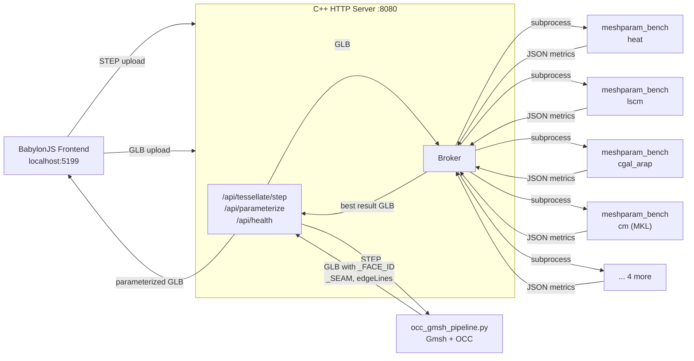
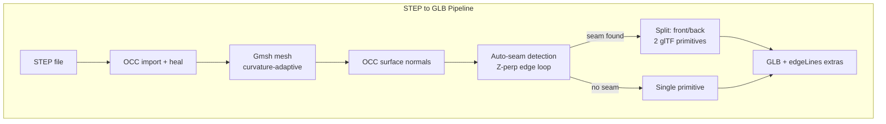

# MeshParameterization

UV parameterization of triangle meshes from STEP/glTF input. Broker architecture with 8 parameterization methods — best result selected automatically by Symmetric Dirichlet energy.

**Target use case**: Window/door hardware parts (handles, hinges) from STEP files.

## Architecture





## Quick Start

```bash
# 1. Prerequisites
#    - Visual Studio 2022 (any edition, C++ workload)
#    - CMake 3.20+, Ninja
#    - Python 3.10+ with pip
#    - vcpkg (optional, for MKL/Intel Pardiso)
#    - Node.js 18+ (for frontend dev server)

# 2. Install Python dependencies
pip install -r requirements.txt

# 3. Build server + CLI tools
cd server
cmake -G Ninja -B build -DCMAKE_BUILD_TYPE=Release \
    -DCMAKE_TOOLCHAIN_FILE=$VCPKG_ROOT/scripts/buildsystems/vcpkg.cmake
cmake --build build

# 4. Copy MKL DLLs (if using vcpkg MKL)
cp $VCPKG_ROOT/installed/x64-windows/bin/mkl_*.dll server/build/

# 5. Start the server
server/build/meshparam_server.exe --port 8080 --web-root web \
    --gmsh-cli "python scripts/occ_gmsh_pipeline.py"

# 6. Start frontend dev server
cd web && npm install && npx vite
# Open http://localhost:5199
```

## Build Options

### Windows (build.bat)
```bash
build.bat                # Auto-detects VS2022, builds Debug
```

### Server + CLI (CMake)
```bash
cd server
cmake -G Ninja -B build -DCMAKE_BUILD_TYPE=Release \
    -DCMAKE_TOOLCHAIN_FILE=/path/to/vcpkg/scripts/buildsystems/vcpkg.cmake
cmake --build build
# Produces: meshparam_server.exe, meshparam_bench.exe
```

### Without vcpkg/MKL
```bash
cd server
cmake -G Ninja -B build -DCMAKE_BUILD_TYPE=Release
cmake --build build
# CM (Composite Majorization) method will be disabled
```

## API

- **Swagger UI**: http://localhost:8080/api/docs
- **OpenAPI spec**: http://localhost:8080/api/openapi.yaml

| Endpoint | Method | Description |
|----------|--------|-------------|
| `/api/health` | GET | Health check |
| `/api/tessellate/step` | POST | STEP file -> GLB mesh (Gmsh + OCC) |
| `/api/parameterize` | POST | GLB -> parameterized GLB with UVs |
| `/api/docs` | GET | Swagger UI |

## Testing

```bash
# Run regression tests
pytest tests/ -v

# HTML report
pytest tests/ --html=tests/regression_report.html --self-contained-html

# Update baselines after intentional changes
UPDATE_BASELINE=1 pytest tests/ -v
```

### Pre-commit hook
Tests run automatically before each commit:
```bash
git config core.hooksPath .githooks
```

## Parameterization Methods

| Method | Algorithm | Quality | Robustness |
|--------|-----------|---------|------------|
| `cm` | Composite Majorization (Newton) | Best | 86% success |
| `cgal_arap` | CGAL ARAP | High | 94% success |
| `slim` | Scalable Locally Injective Maps | Good | 100% success |
| `lscm` | Least Squares Conformal Maps | Good | 100% success |
| `igl_arap` | libigl ARAP | Good | 100% success |
| `heat` | Heat-geodesic MDS | Moderate | 96% success |
| `cgal_conformal` | CGAL Discrete Conformal | Low | 99% success |
| `cgal_authalic` | CGAL Discrete Authalic | Low | 99% success |

## Project Structure

```
server/             C++ HTTP server + CLI parameterization tools
scripts/            Python pipeline (Gmsh tessellation, benchmarks)
web/                BabylonJS frontend (Vite dev server)
include/meshparam/  C++ library headers
src/                C++ library source (heat-geodesic)
cgal_param/         CGAL parameterization library
extern/CompMajor/   Composite Majorization (Newton optimizer)
models/
  step/             STEP CAD test files
  glTF/             Pre-tessellated GLB meshes
  benchmark/        Stein et al. 2022 dataset (gitignored)
tests/              Regression tests (pytest + C++ unit tests)
Documents/          Reference papers
```

## Benchmark Data

The Stein et al. 2022 dataset is too large for git:
```bash
# Download from: https://github.com/SteinEtAl/ParameterizationBenchmark
mkdir -p models/benchmark
# Place Obj_Files/ inside models/benchmark/
```

## Dependencies

### C++ (fetched by CMake FetchContent)
Eigen 3.4, libigl 2.5, CGAL 5.5, Boost 1.85, tinygltf, Spectra, Intel MKL (optional)

### Python
See `requirements.txt`: gmsh, numpy, pytest, pytest-html

### Frontend
See `web/package.json`: BabylonJS, Vite, swagger-ui-dist
